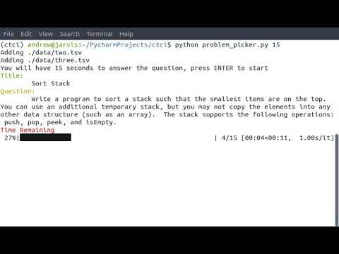

# ctci

Serves as a training aid for **Cracking the Coding Interview, 6th Edition**.

Use the included ```environment.yml``` file to create a conda virtual environment

- [Sample Video](http://www.youtube.com/watch?v=U8GumpZ9LMk "Random Interview Question Picker")



## How to Run

To run this script from any directory, modify and add the following script into your `$PATH`:

```sh
#!/usr/bin/env bash

# Calls ctci/problem_picker.py
# MOVE THIS INTO location that is in your $PATH

# UPDATE THIS
SCRIPT_LOCATION="/PATH/TO/ctci"

cd "$SCRIPT_LOCATION"

pipenv run python problem_picker.py "$@"
```
